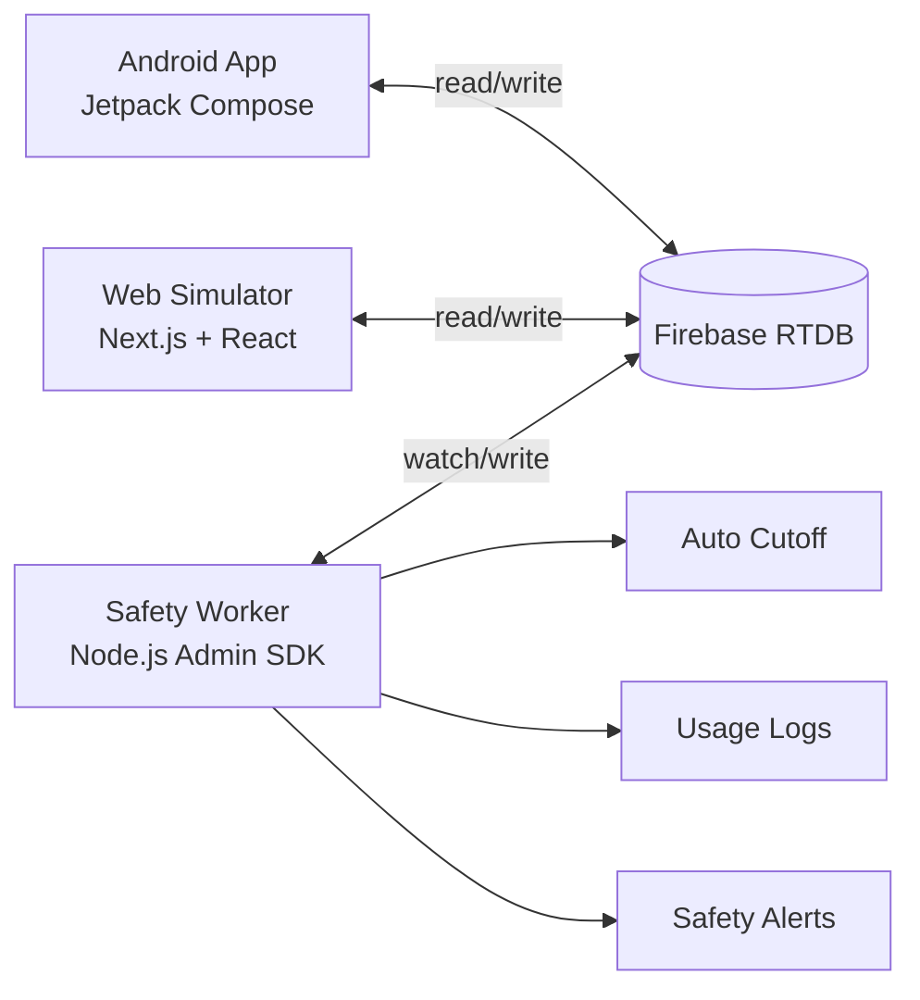

# Smart Home System

> A real-time ambient intelligence project where interface, automation, and safety converge.

This repository is not just an app. It is a small distributed system for home orchestration:
an A**ndroid control surface**, a **web-based simulator**, and an autonomous safety **microservice**,
all synchronized through Firebase Realtime Database.

The result is a project that feels product-minded and systems-aware at the same time.

## Setup guide for collaborators

For a full fresh-machine setup on both macOS and Windows, use:

- [SETUP_TUTORIAL.md](SETUP_TUTORIAL.md)

## Why this project stands out

- Multi-platform architecture with one shared source of truth.
- Event-driven safety automation (not polling loops).
- Live state synchronization across web, mobile, and backend worker.
- Practical IoT model with floors, device grids, schedules, streams, and alerts.
- Built like a deployable prototype, not a one-screen demo.

## System architecture

Three decoupled services communicate through Firebase Realtime Database.

## Tech stack

### Mobile client
- Kotlin
- Jetpack Compose
- Firebase Realtime Database KTX
- Android SDK 37, Java 17

### Web simulator
- Next.js (App Router)
- React 19
- Tailwind CSS
- Firebase Web SDK

### Safety worker (The Back-end and few micro-services basically)
- Node.js
- Firebase Admin SDK
- Event-driven timer orchestration

## Core capabilities

### Real-time device orchestration
- View and control devices by floor.
- Toggle smart switches, lighting, multi-switch panels, and cameras.
- Add and remove floors/devices from the simulator.

### Safety-first automation
- Safety worker listens to live floor/device changes.
- For eligible smart switches, it arms one-shot cut-off timers.
- If a device exceeds max active duration, it is automatically turned OFF.
- Every forced cut-off is written into usage logs and alerts.

### Operational visibility
- Live connection health indicators.
- Device status surfaces for ON/OFF/disconnected states.
- Camera stream mock support for monitoring workflow simulation.

## Quick start

### 1) Seed the database

cd safety-worker
npm install
npm run seed

### 2) Run the safety worker

cd safety-worker
npm start

### 3) Run the web simulator

cd web-simulator
npm install
npm run dev

Then open: http://localhost:3000

### 4) Build or run mobile client

- Option A: Open mobile-client in Android Studio. (Install the app-debug.apk on the Emulator Device and run it)

- Option B: Use your physical android device to install the app-debug.apk on the device.
  
## Engineering decisions

- Decoupled clients and worker for clear service boundaries.
- Event subscription + one-shot timers to avoid brute-force polling.
- Safety behavior implemented server-side for reliability.
- Shared schema keeps platform clients simple and consistent.
- Keeps logs for the events happening in the system.
- Send alerts about security issues and etc. to the user those can be acknowledged.